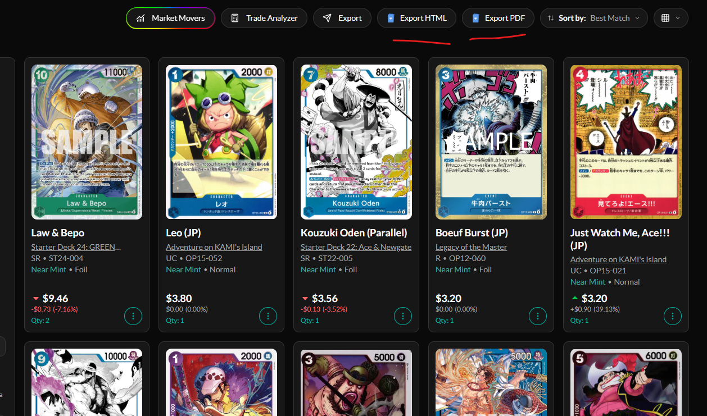

# Collectr Exporter

A Chrome extension for exporting the Collectr products currently visible on the page as HTML or PDF.

## About

[Collectr](https://app.getcollectr.com) is a portfolio and collection tracker for collectible products. I created this extension because I wanted a simple way to take the collection view from Collectr with me as a standalone HTML file or a printable PDF.

It adds export controls to the Collectr products page while keeping the original page workflow intact. The export reflects the products that Collectr has loaded, which makes it useful for saving, sharing, or printing a snapshot of a collection.

## Important

The exporter captures what Collectr has loaded on the page at the time you export.

If you want to export your whole collection, scroll down through the page first so Collectr can load the rest of your products. Then use **Export as HTML**, **Export as PDF**, or the matching buttons added to the page.

## Installation

1. Download or clone this repository to your computer.
2. Open Chrome and go to `chrome://extensions`.
3. Turn on **Developer mode** in the top-right corner.
4. Click **Load unpacked**.
5. Select the `CollectrExporter` folder containing `manifest.json`.
6. Open your Collectr products page and refresh it.

When you change the extension files, return to `chrome://extensions`, click **Reload** on Collectr Exporter, and refresh the Collectr page.

## Usage

1. Open your Collectr portfolio/products page.
2. Scroll down until the products you want are loaded.
3. Open the extension popup or use the buttons added beside Collectr's export button.
4. Choose HTML or PDF.

PDF export opens the browser print dialog. Choose **Save as PDF** to save the file.
